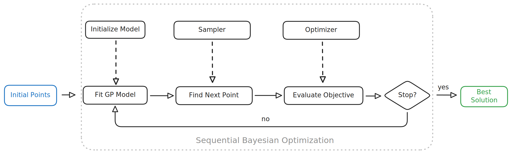

# Nano BO: A Minimal Bayesian Optimization Implementation



Inspired by Andrej Karpathy's [nanoGPT](https://github.com/karpathy/nanoGPT), **Nano BO** is a lightweight, easy-to-understand, and practical implementation of Bayesian Optimization (BO). It is designed for both educational and practical purposes, offering a minimal yet functional framework for optimizing black-box functions.


## Key Features

- **Farthest Point Sampling (FPS)**: Efficient initialization of sample points to ensure good coverage of the search space.
- **Gaussian Process (GP)**: A probabilistic surrogate model for modeling the objective function.
- **Expected Improvement (EI)**: A widely used acquisition function that balances exploration and exploitation.
- **Compound Kernel (RBF + White Noise)**: Supports Automatic Relevance Determination (ARD) for multi-dimensional inputs.
- **L-BFGS-B Optimization**: Multi-start optimization with random restarts for acquisition function maximization.
- **Active Learning Mode**: Allows interactive labeling when the objective function is not explicitly provided.


## Mathematical Background

Bayesian Optimization is a sequential design strategy for global optimization of expensive black-box functions. It is particularly useful when the function evaluations are costly, noisy, or lack a closed-form expression.

### Key Components:

1. **Surrogate Model (Gaussian Process)**:
    - Models the objective function $f(x)$ as a Gaussian Process (GP).
    - Provides estimates of the mean $\mu(x)$ and variance $\sigma^2(x)$ for any input $x$.
    - Uses kernel functions to measure similarity between points and define smoothness.

2. **Acquisition Function (Expected Improvement)**:

Balances exploration (high uncertainty) and exploitation (low mean). The Expected Improvement (EI) is given by:

$$
\text{EI}(x) = \mathbb{E}[\max(0, f_{\text{best}} - f(x))]
$$

$$
\text{EI}(x) = (f_{\text{best}} - \mu(x) - \xi)\Phi(Z) + \sigma(x)\phi(Z)
$$

where $Z = \frac{f_{\text{best}} - \mu(x) - \xi}{\sigma(x)}$, $\Phi$ is the CDF, and $\phi$ is the PDF of the standard normal distribution.


3. **Optimization Process**:
    - **Step 1**: Initialize sample points using Farthest Point Sampling (FPS) or random sampling.
    - **Step 2**: Iteratively:
        1. Fit the GP to observed data.
        2. Optimize the acquisition function to select the next point.
        3. Evaluate the objective function (or query the user in active learning mode).
        4. Update the GP model with the new observation.
    - **Step 3**: Return the best observed point.


## Code Structure

### Core Components:

- **`Config`**: A configuration class for customizing the Bayesian Optimization process (e.g., number of iterations, kernel parameters, acquisition function settings).
- **`Kernel`**: Base class for kernels, including:
  - `RBFKernel`: Radial Basis Function kernel with ARD for multi-dimensional inputs.
  - `WhiteKernel`: Adds white noise for numerical stability.
  - `CompoundKernel`: Combines multiple kernels.
- **`GaussianProcess`**: Implements Gaussian Process regression for modeling the objective function.
- **`ExpectedImprovement`**: Computes the Expected Improvement acquisition function.
- **`BayesianOptimization`**: The main class that orchestrates the optimization process.
- **`Farthest Point Sampling (FPS)`**:
    - Generates initial points by maximizing the minimum distance between sampled points.
    - Ensures good coverage of the search space.
- **`L-BFGS-B Optimization`**:
    - Optimizes the acquisition function using a gradient-based method.
    - Uses multiple random restarts to avoid poor local optima.


## How to Use

### 1. Install Dependencies

The implementation relies on the following Python libraries:
- `numpy`
- `scipy`
- `tqdm`

You can install the dependencies using:
```bash
pip install numpy scipy tqdm
```

### 2. Run the Script

The `nano_bo.py` script includes examples of:
- 1D optimization with an explicit function.
- 2D optimization with an explicit function.
- Active learning mode for black-box optimization.

To run the script, simply execute:
```bash
python nano_bo.py
```

### 3. Example Use Cases

#### 1D Optimization

The script includes a simple 1D test function:
```python
def objective_1d(x):
    return np.sin(3 * x) * x**2 + 0.7 * np.cos(2 * x)
```
Output:
```
Best parameters: [0.123]
Best value: -1.234
```

#### 2D Optimization

The script also demonstrates optimization of the Six-Hump Camel function:
```python
def objective_2d(x):
    x1, x2 = x[0], x[1]
    return (4 - 2.1 * x1**2 + (x1**4) / 3) * x1**2 + x1 * x2 + (-4 + 4 * x2**2) * x2**2
```
Output:
```
Best parameters found: [0.0898, -0.7126]
Best value found: -1.0316
```

#### Active Learning in Black Box Optimization

In cases where the objective function is not or can not explicitly defined, the script enters interactive labeling mode, where the user provides evaluations for queried points, such as chemistry experiment results.


## Customization

You can customize the optimization process by modifying the `Config` class. Key parameters include:
- `n_iterations`: Number of optimization iterations.
- `init_points`: Number of initial points.
- `length_scale`: Length scale of the RBF kernel.
- `xi`: Exploration-exploitation trade-off in the EI acquisition function.
- `random_state`: Seed for reproducibility.

Example:
```python
config = Config(
    n_iterations=30,
    init_points=10,
    length_scale=0.5,
    xi=0.02,
    random_state=123
)
```

## Educational Value

Nano BO is designed to be simple and accessible, making it an excellent resource for learning about Bayesian Optimization. The code avoids unnecessary complexity while retaining the core principles of BO, making it ideal for:
- Researchers looking to understand BO algorithms.
- Developers implementing BO in their projects.
- Educators teaching optimization techniques.


## Limitations

- **Scalability**: Gaussian Processes scale poorly with large datasets due to $O(n^3)$ complexity.
- **Limited Kernels**: Only basic RBF and White Noise kernels are implemented.
- **No Parallelization**: The implementation does not support parallel evaluations.


## Acknowledgments

This project was inspired by Andrej Karpathy's [nanoGPT](https://github.com/karpathy/nanoGPT), which emphasizes simplicity and clarity in implementation.